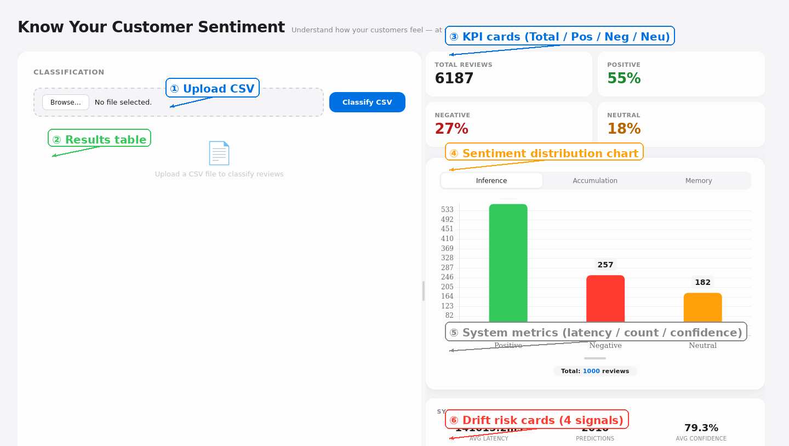
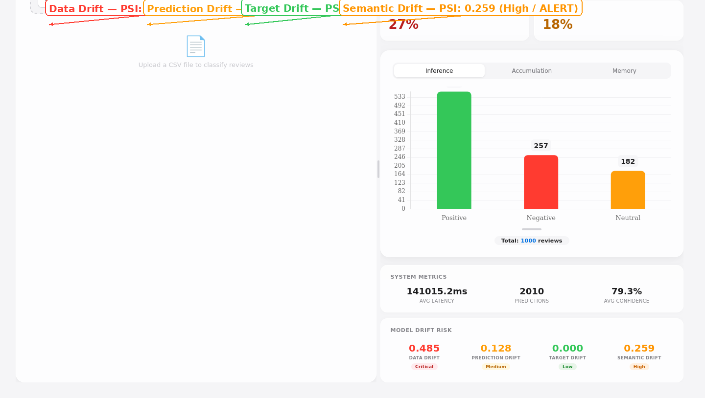
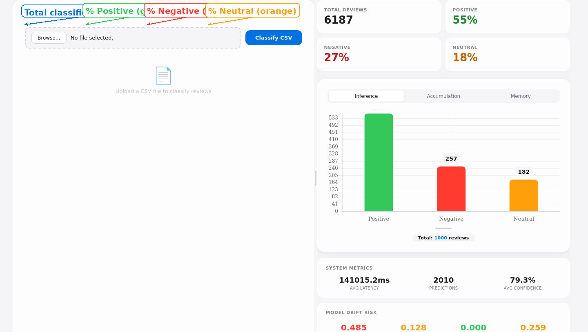
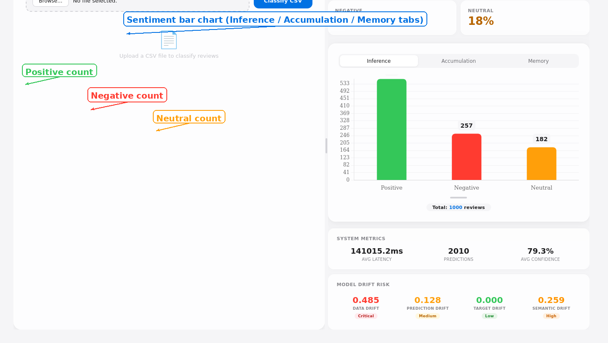

# Know Your Customer Sentiment

Understand how your customers *really* feel — at scale, continuously, and without breaking the bank.

Every customer review, support ticket, and social media mention is a signal. This project ingests those signals, classifies them as positive / neutral / negative, and **watches for when the language of your audience shifts** so you can retrain before your model goes stale.

---

## The UI at a Glance



The interface is split into two panels. Upload a CSV on the left, watch results pour in on the right.

### ① Upload CSV — top left
Drop any CSV containing a `text` column. The server classifies every row through an ensemble of two sentiment models (twitter-trained + amazon-trained).

### ② Results table — left panel
Every row shows its original text, predicted sentiment (color-coded), confidence score, and which model was used. Download the enriched CSV or clear the cache between runs.

### ③ KPI cards — top right
Four glassmorphism cards show the pulse of your data:
- **Total Reviews** classified in the current accumulation window
- **Positive / Negative / Neutral** percentages — green, red, and orange

### ④ Sentiment distribution chart — center right
A live bar chart of positive / negative / neutral counts. Toggle between:

| Tab | What it shows |
|---|---|
| **Inference** | Current batch just classified |
| **Accumulation** | Cumulative totals over the configured time window (resets periodically) |
| **Memory** | Archived historical periods — compare this week vs last week |

Resize the chart vertically with the handle at the bottom.

### ⑤ System metrics — below chart
- **Avg Latency**: milliseconds per classification
- **Predictions**: total since server start
- **Avg Confidence**: mean model confidence across all predictions

### ⑥ Drift risk cards — bottom right



Four cards, one per drift signal. Each shows the PSI value, a color-coded level badge, and auto-updates every few seconds:

| Card | Color | PSI Range | Meaning |
|---|---|---|---|
| **Data Drift** | 🟢 🟡 🟠 🔴 | 0 → 0.3+ | Text length distribution shift |
| **Prediction Drift** | 🟢 🟡 🟠 🔴 | 0 → 0.3+ | Model confidence distribution shift |
| **Target Drift** | 🟢 🟡 🟠 🔴 | 0 → 0.3+ | Sentiment label distribution shift |
| **Semantic Drift** | 🟢 🟡 🟠 🔴 | 0 → 0.3+ | Language / embedding space shift |

> **PSI ≥ 0.25 triggers an ALERT.** That is your signal to collect new data and trigger a PEFT retraining run.

### KPI cards — close-up



Four compact stats at the top of the right panel — total count and three sentiment percentages. These reflect the current accumulation window (default 24h).

### Sentiment chart — close-up



The bar chart supports three views. Resize it vertically with the handle. Each bar shows the exact count as a floating label. Hover for Chart.js tooltips.

---

## Why this exists

Sentiment analysis is not a one-time ML exercise. It is a **business feedback loop**. Language evolves. Internet culture redefines words overnight ("sick", "literally", "cringe"). A model that was accurate last quarter may miss half your negatives today, and that means missed churn signals.

This project is built around three principles that keep the feedback loop fast, cheap, and transparent:

### 1. Cost efficient

The inference backbone is **RoBERTa** — an open-source transformer that runs on modest hardware (4 GB GPU). All fine-tuning uses **LoRA adapters** (Low-Rank Adaptation): a few MB instead of gigabytes, minutes instead of hours, pennies instead of dollars. The base model stays frozen and permanent in memory; only the tiny adapter is swapped.

### 2. Plug-in / plug-out — ease of experimentation

One YAML file controls the entire model stack. Want to switch from RoBERTa to BERT, DeBERTa, or distilled variant? Change `pretrained_name` in `configs/model/<name>.yaml` and the project rewires itself — preprocessing, inference, embedding extraction for drift, all of it. The same philosophy applies to LoRA adapters: drop in an `adapter_config.json`, and the inference server picks it up at startup. Delete it, and it falls back to the base model. No code changes. No redeploy.

### 3. Monitoring as a first-class citizen

A model that drifts silently is worse than no model at all. This project computes **four drift signals** continuously:

| Drift | What it measures | Why it matters |
|---|---|---|
| **Data drift** | Text length distribution vs training | Customers suddenly writing longer/shorter reviews? |
| **Target drift** | Sentiment label distribution vs training | Are people getting angrier / happier overall? |
| **Prediction drift** | Model confidence distribution vs training | Is the model becoming unsure? |
| **Semantic drift** | [CLS] embedding distribution via PCA + KMeans → PSI | Language itself may be shifting ("sick" means cool now) |

When any PSI crosses the **alert threshold (≥ 0.25)**, a card turns red in the dashboard. You inspect, collect new data, and trigger a PEFT retraining run — all from the UI.

> The core insight: **you cannot fix what you do not measure.** Semantic drift detection catches the kind of linguistic shift that accuracy metrics miss until it is too late.

---

## Architecture

```
┌─────────────────────────────────────────────────────────┐
│                    Airflow DAGs                         │
│  ┌─────────────────┐   ┌────────────────────────────┐  │
│  │  Base Pipeline   │   │  PEFT Training (manual)    │  │
│  │  (schedule)      │   │  (triggered from drift)    │  │
│  └────────┬─────────┘   └──────────┬─────────────────┘  │
│           │                        │                    │
│           ▼                        ▼                    │
│  ┌──────────────────────────────────────────┐          │
│  │          artifacts/models/<name>/         │          │
│  │  ├── adapter_model.safetensors (LoRA)    │          │
│  │  ├── monitoring/                         │          │
│  │  │   ├── data_drift_baseline.json        │          │
│  │  │   ├── prediction_drift_baseline.json  │          │
│  │  │   ├── target_drift_baseline.json      │          │
│  │  │   ├── semantic_pca.pkl                │          │
│  │  │   ├── semantic_kmeans.pkl             │          │
│  │  │   └── semantic_expected.npy           │          │
│  │  └── config.yaml                        │          │
│  └──────────────────────────────────────────┘          │
└─────────────────────────┬───────────────────────────────┘
                          │
                          ▼
┌─────────────────────────────────────────────────────────┐
│              FastAPI Inference Server                    │
│  ┌──────────┐  ┌──────────────┐  ┌──────────────────┐  │
│  │ /predict │  │ /drift/metrics│  │ /lifecycle/metrics│  │
│  │ (CSV in) │  │  (PSI + risk) │  │ (uptime, requests)│  │
│  └────┬─────┘  └──────┬───────┘  └────────┬─────────┘  │
│       │               │                    │            │
│       ▼               ▼                    ▼            │
│  predictions.jsonl ───┤                    │            │
│  ┌─────────────────────┐                   │            │
│  │  Decision Engine    │ ← ensemble logic  │            │
│  │  (twitter / amazon) │                   │            │
│  └─────────────────────┘                   │            │
│                                            │            │
│  ┌──────────────────────────────────────┐  │            │
│  │         Prometheus Gauges            │ ◄┘            │
│  │  drift_data_psi, drift_target_psi,   │              │
│  │  drift_prediction_psi, semantic_...  │              │
│  └──────────────────┬───────────────────┘              │
└─────────────────────┼───────────────────────────────────┘
                      │
                      ▼
┌─────────────────────────────────────────────────────────┐
│              Grafana Dashboard                           │
│  4 drift cards with color gradient: green→yellow→red    │
│  Retraining alert: PSI ≥ 0.25                            │
└─────────────────────────────────────────────────────────┘
```

### Two DAGs, one philosophy

| DAG | Trigger | What it does |
|---|---|---|
| `base_model_dag` | Schedule or manual | Preprocess raw data → evaluate base model → generate semantic baselines (PCA, KMeans) |
| `peft_training` | **Manual only** (from drift dashboard) | Train LoRA adapter → evaluate with PEFT → generate all drift baselines → deploy to inference dir |

The base pipeline runs automatically. The training pipeline is manual by design: you should never retrain unless drift tells you to. GPU time is money.

---

## Quick start

### Prerequisites

- Python 3.11+
- CUDA-capable GPU (optional but recommended; 4 GB VRAM is enough)
- Docker + Docker Compose (for inference server and monitoring stack)

### 1. Clone and set up

```bash
git clone https://github.com/Mohamedmagdy21/sentiment_analyzer.git
cd sentiment_analyzer
python3 -m venv venv_cuda
source venv_cuda/bin/activate
pip install -r requirements.txt
```

### 2. Preprocess data

```bash
python3 -m preprocessing.preprocess dataset=twitter
python3 -m preprocessing.preprocess dataset=amazon
```

### 3. Evaluate the base model (no training needed)

```bash
python3 -m evaluation.evaluate dataset=twitter model=twitter_roberta evaluator.use_peft=False
```

### 4. Generate monitoring baselines

```bash
python3 -c "
from inference.monitoring_utils import generate_and_save_baselines
from inference.model_loader import predict
from transformers import AutoTokenizer, AutoModelForSequenceClassification
import pandas as pd, torch, numpy as np

for name in ['twitter', 'amazon']:
    train_df = pd.read_csv(f'Data/processed/{name}/train.csv')
    val_df = pd.read_csv(f'Data/processed/{name}/val.csv')
    tokenizer = AutoTokenizer.from_pretrained('cardiffnlp/twitter-roberta-base-sentiment')
    model = AutoModelForSequenceClassification.from_pretrained(
        'cardiffnlp/twitter-roberta-base-sentiment', num_labels=3, ignore_mismatched_sizes=True
    ).to('cuda' if torch.cuda.is_available() else 'cpu')
    model.eval()
    _, probs = predict(val_df['text'].dropna().astype(str).tolist(), tokenizer, model, batch_size=16)
    generate_and_save_baselines(name, train_df, val_df, target_col='label', val_confidences=probs.max(axis=1))
    del model
    torch.cuda.empty_cache()
"
```

For semantic baselines (embedding-based drift):

```bash
PYTORCH_CUDA_ALLOC_CONF=expandable_segments:True python3 -c "
from inference.semantic_monitoring_utils import fit_semantic_baseline
import pandas as pd
for name in ['twitter', 'amazon']:
    df = pd.read_csv(f'Data/processed/{name}/train.csv')
    texts = df['text'].dropna().astype(str).tolist()
    fit_semantic_baseline(name, texts, labels=df['label'].values if 'label' in df.columns else None)
"
```

### 5. Start the inference server + monitoring stack

```bash
docker compose up -d
```

This starts:
- **FastAPI inference server** at `http://localhost:8000`
- **Prometheus** at `http://localhost:9090`
- **Grafana** at `http://localhost:3000` (admin / admin)

### 6. Upload and classify

```bash
curl -X POST http://localhost:8000/predict \
  -F "file=@test_sample_1000.csv"
```

Or open `http://localhost:8000` in your browser, upload a CSV, and click **Classify CSV**.

### 7. Verify drift monitoring

```bash
python3 scripts/production_drift_job.py
python3 scripts/production_semantic_drift_job.py
```

Then check `http://localhost:8000` — the four drift cards populate with risk levels.

> **Tip:** Generate at least 500 inference predictions before running drift jobs — the volume guardrail enforces a minimum sample size for statistically meaningful PSI computation.

---

## Training a LoRA adapter (when drift triggers it)

```bash
python3 -m training.train dataset=twitter model=twitter_roberta
python3 -m training.train dataset=amazon model=amazon_roberta
```

This trains a LoRA adapter and saves it to `artifacts/models/<name>/`. The inference server detects it automatically on next startup.

Or deploy a trained adapter from Colab / Kaggle:

```bash
python3 -c "
import shutil, os
for name in ['twitter', 'amazon']:
    src = f'artifacts/models/{name}'
    dst = f'inference/artifacts/models/{name}'
    os.makedirs(os.path.dirname(dst), exist_ok=True)
    if os.path.exists(dst): shutil.rmtree(dst)
    shutil.copytree(src, dst)
"
```

Restart the inference container:

```bash
docker compose restart inference
```

---

## Switching the base model

Edit `configs/model/twitter_roberta.yaml` (or `amazon_roberta.yaml`):

```yaml
pretrained_name: "google-bert/bert-base-uncased"  # or any HuggingFace model
num_labels: 3
```

Regenerate baselines and restart. That is it.

---

## Project structure

```
├── configs/
│   ├── model/              # YAML model definitions (plug-in / plug-out)
│   ├── dataset/            # Dataset paths and splits
│   ├── preprocessing/      # Preprocessing pipeline configs
│   └── evaluator/          # Evaluator configs (use_peft flag)
├── dags/
│   ├── base_model_dag.py           # Base pipeline (schedule)
│   └── sentiment_training_dag.py   # PEFT training (manual trigger)
├── inference/
│   ├── main.py                     # FastAPI server
│   ├── model_loader.py             # Auto-detect PEFT / base model
│   ├── decision_engine.py          # Twitter + amazon ensemble
│   ├── monitoring_utils.py         # PSI computation, drift baselines
│   ├── semantic_monitoring_utils.py # PCA + KMeans embedding drift
│   ├── static/index.html           # Glassmorphism UI
│   └── schemas.py
├── training/
│   ├── train.py                    # Hydra entry point
│   └── trainers/hf_trainer.py      # LoRA training loop
├── evaluation/
│   └── evaluators/hf_evaluator.py  # Evaluate with / without PEFT
├── preprocessing/
│   └── preprocess.py
├── scripts/
│   ├── production_drift_job.py           # 24h data/target/prediction drift
│   └── production_semantic_drift_job.py  # 24h semantic drift
├── Data/
│   ├── raw/                # Raw CSVs (DVC-tracked)
│   └── processed/          # Cleaned train/val/test splits
├── docker-compose.yml
├── Dockerfile
└── prometheus/             # Prometheus config + alert rules
```

---

## License

MIT
