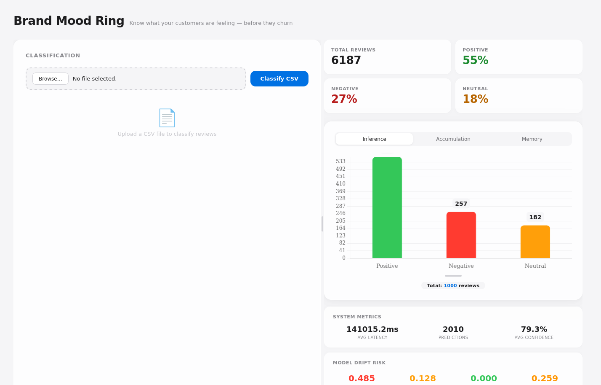

# Read the Room

Know what your customers are feeling — before they churn.



Every review, support ticket, and social mention is a signal that most businesses ignore until the quarterly report. This project turns those signals into real-time sentiment data and — more importantly — **tells you when the way people talk about your brand has shifted**, so you can adapt before your engagement metrics do.

---

## Why this exists

Sentiment analysis is not a one-time ML project. It is a business feedback loop.

Language evolves. Internet culture redefines words overnight. "Sick" meant disgusting ten years ago — today it means awesome. A model trained on last year's data will miss half of today's negatives, which means you miss churn signals, which means you lose customers you could have kept.

This project is built around three principles:

### Cost efficient
Open-source **RoBERTa** runs on a 4 GB GPU. All fine-tuning uses **LoRA adapters** — megabytes instead of gigabytes, minutes instead of hours. The base model stays in memory permanently; only the tiny adapter gets swapped.

### Plug-in / plug-out
Change `pretrained_name` in one YAML file and the entire project rewires itself — preprocessing, inference, embedding extraction for drift. Drop an `adapter_config.json` into the models folder and the server picks it up on restart. Delete it and it falls back to the base model. No code changes.

### Monitoring or it didn't happen
Four drift signals run continuously. When any crosses the alert threshold, a card turns red in the dashboard and you know it is time to retrain — not because a calendar told you to, but because the data did.

---

## The UI

### Classify + Cache
Upload a CSV with a `text` column. Every row runs through a two-model ensemble (reviews + social media). Results stream back with sentiment, confidence, and which model decided. Re-upload the same file and results load instantly from cache.

### Three chart views

| View | Resets | Why |
|---|---|---|
| **Inference** | Every new upload | See what the model thinks right now. |
| **Accumulation** | Every quarter | Spot trends mid-quarter — adjust campaigns, staffing, or messaging before the quarter ends. |
| **Memory** | Never | Compare last quarter to this one. Did that pricing change help? Did the feature launch shift sentiment? |

Accumulation is your canary. Memory is your history book. Together they make sentiment a leading indicator, not a lagging one.

### System metrics
- **Avg Latency** — ms per classification. Creep = bottleneck.
- **Predictions** — total since server start.
- **Avg Confidence** — dropping mean confidence is a leading drift signal, before PSI confirms it.

### Model Drift Risk

Four cards at the bottom right. PSI (Population Stability Index) measures how much a distribution has shifted from training to now:

| Card | What it measures | If it turns red |
|---|---|---|
| **Data Drift** | Text length distribution | Customers changed how they write. May need a new data sample. |
| **Prediction Drift** | Confidence distribution | The model is seeing unfamiliar inputs. |
| **Target Drift** | Sentiment label mix | Customers are genuinely changing how they feel. |
| **Semantic Drift** | Word choice distribution (PCA + KMeans → PSI) | The *words people use* are changing. This is your earliest warning — "sick" now means cool and the model has no idea. |

PSI is unbounded. Risk levels: **low < 0.1 → medium < 0.2 → high < 0.3 → critical ≥ 0.3**. Alert threshold is **PSI ≥ 0.25**.

> A red drift card does not mean the model is broken. It means the world moved, and the model hasn't.

---

## Architecture

```
Base DAG (scheduled) ──► artifacts/models/<name>/monitoring/
PEFT DAG (manual)    ──►   ├── data_drift_baseline.json
                            ├── prediction_drift_baseline.json
                            ├── target_drift_baseline.json
                            ├── semantic_pca.pkl + kmeans.pkl
                            └── semantic_expected.npy
                              │
FastAPI Server               │
  /predict ─► predictions.jsonl ─► PSI ─► Prometheus ─► Grafana
  /drift/metrics
  /lifecycle/metrics ─► accumulation + memory
```

---

## Quick start

```bash
git clone https://github.com/Mohamedmagdy21/sentiment_analyzer.git
cd sentiment_analyzer
python3 -m venv venv_cuda && source venv_cuda/bin/activate
pip install -r requirements.txt
```

**Sets up the project:**
- `venv_cuda` — isolated Python environment so dependencies don't conflict with other projects on your machine
- `pip install` — installs PyTorch, Transformers, FastAPI, Prometheus client, pandas, and everything else needed

---

```bash
python3 -m preprocessing.preprocess dataset=twitter
python3 -m preprocessing.preprocess dataset=amazon
```

**Prepares the raw data:**
- Reads `Data/raw/twitter.csv` and `Data/raw/amazon.csv`
- Cleans text (removes URLs, special characters, normalizes whitespace)
- Maps string sentiment labels (`positive`, `negative`, `neutral`) to integers (0, 1, 2)
- Splits into `train.csv` / `val.csv` / `test.csv` and saves to `Data/processed/<name>/`
- **Only needs to run once.** The processed CSVs are cached on disk.

---

```bash
python3 -m evaluation.evaluate dataset=twitter model=twitter_roberta evaluator.use_peft=False
```

**Runs the base model against test data to get accuracy metrics:**
- Loads `cardiffnlp/twitter-roberta-base-sentiment` (no LoRA adapter — `use_peft=False`)
- Runs inference on `Data/processed/twitter/test.csv`
- Prints accuracy, weighted F1, and per-class precision / recall
- Saves results to `artifacts/models/twitter/evaluation_results_*.txt`
- This is a sanity check — if base accuracy is low, something is wrong with the data

---

```bash
python3 -c "
from inference.monitoring_utils import generate_and_save_baselines
from inference.model_loader import predict
from transformers import AutoTokenizer, AutoModelForSequenceClassification
import pandas as pd, torch, numpy as np
for name in ['twitter', 'amazon']:
    train_df = pd.read_csv(f'Data/processed/{name}/train.csv')
    val_df = pd.read_csv(f'Data/processed/{name}/val.csv')
    tokenizer = AutoTokenizer.from_pretrained('cardiffnlp/twitter-roberta-base-sentiment')
    model = AutoModelForSequenceClassification.from_pretrained(
        'cardiffnlp/twitter-roberta-base-sentiment', num_labels=3, ignore_mismatched_sizes=True
    ).to('cuda' if torch.cuda.is_available() else 'cpu')
    model.eval()
    _, probs = predict(val_df['text'].dropna().astype(str).tolist(), tokenizer, model, batch_size=16)
    generate_and_save_baselines(name, train_df, val_df, target_col='label', val_confidences=probs.max(axis=1))
    del model; torch.cuda.empty_cache()
"
```

**Generates the data / target / prediction drift baselines:**
For each model (`twitter`, `amazon`):
1. Loads the training CSV and validation CSV
2. Loads the base RoBERTa model and runs it on the validation set
3. Computes the **actual confidence histogram** (not a uniform distribution) from the model's predictions on validation data
4. Saves to `artifacts/models/<name>/monitoring/`:
   - `data_drift_baseline.json` — text length distribution from training (10 quantile bins)
   - `target_drift_baseline.json` — label distribution from training (positive / neutral / negative proportions)
   - `prediction_drift_baseline.json` — confidence histogram from the model on validation data (10 equal-width bins spanning min→max confidence)

These files are what the drift cards compare against. Without them, every PSI value is `null`.

---

```bash
PYTORCH_CUDA_ALLOC_CONF=expandable_segments:True python3 -c "
from inference.semantic_monitoring_utils import fit_semantic_baseline
import pandas as pd
for name in ['twitter', 'amazon']:
    df = pd.read_csv(f'Data/processed/{name}/train.csv')
    texts = df['text'].dropna().astype(str).tolist()
    fit_semantic_baseline(name, texts, labels=df['label'].values if 'label' in df.columns else None)
"
```

**Generates the semantic drift baseline (embedding-based drift detection):**
For each model:
1. Takes a stratified sample of 10,000 texts from the training set
2. Passes them through the frozen RoBERTa base model and extracts the **[CLS]** embedding from the last hidden layer (a 768-dimensional vector per text)
3. Reduces dimensionality from 768 → 5 using **PCA** (faster and deterministic — replaced UMAP which crashed on 4 GB GPUs)
4. Clusters the 5D embeddings into **10 groups using KMeans**
5. Records the proportion of texts in each cluster — this is the "expected" semantic distribution
6. Saves `semantic_pca.pkl`, `semantic_kmeans.pkl`, and `semantic_expected.npy` to the monitoring directory

`PYTORCH_CUDA_ALLOC_CONF=expandable_segments:True` prevents the GPU from crashing on OOM when extracting 10k embeddings at once on a 4 GB card.

**What semantic drift catches that PSI on text length / labels misses:**
Semantic drift detects when the *vocabulary* of your customers changes — words like "sick," "literally," or "fire" being used in new ways. Text length and label distributions might look stable while the embedding space has already shifted. This is typically the earliest warning sign.

---

```bash
docker compose up -d
```

**Starts three services:**

| Service | Port | What it does |
|---|---|---|
| `inference` | `8000` | FastAPI server — `/predict` (CSV upload), `/drift/metrics` (PSI + risk), `/lifecycle/metrics` (accumulation + memory), static UI at `/` |
| `prometheus` | `9090` | Scrapes `/metrics` every 15s — stores latency, prediction count, confidence, and all drift PSI gauges |
| `grafana` | `3000` | Dashboards powered by Prometheus — optional, the built-in UI at `:8000` already shows drift cards |

Volumes are mounted from `artifacts/` so models, baselines, and inference logs persist across restarts.

Open `http://localhost:8000`, upload a CSV, click **Classify CSV**.

### Drift verification

```bash
python3 scripts/production_drift_job.py
python3 scripts/production_semantic_drift_job.py
```

The drift cards populate at the bottom of the UI.

---

## Training (when drift says so)

```bash
python3 -m training.train dataset=twitter model=twitter_roberta
python3 -m training.train dataset=amazon model=amazon_roberta
```

Restart the container and the server picks up the LoRA adapter automatically.

---

## Project structure

```
├── configs/model/          # YAML — change pretrained_name to swap models
├── dags/                   # Airflow pipelines
├── inference/              # FastAPI server + drift monitoring
├── training/               # LoRA fine-tuning
├── evaluation/             # Model evaluation (with/without PEFT)
├── preprocessing/          # Text cleaning + train/val/test split
├── scripts/                # Production drift jobs
├── Data/                   # Raw + processed CSVs
├── docker-compose.yml
└── prometheus/             # Alert rules
```

---

## License

MIT
